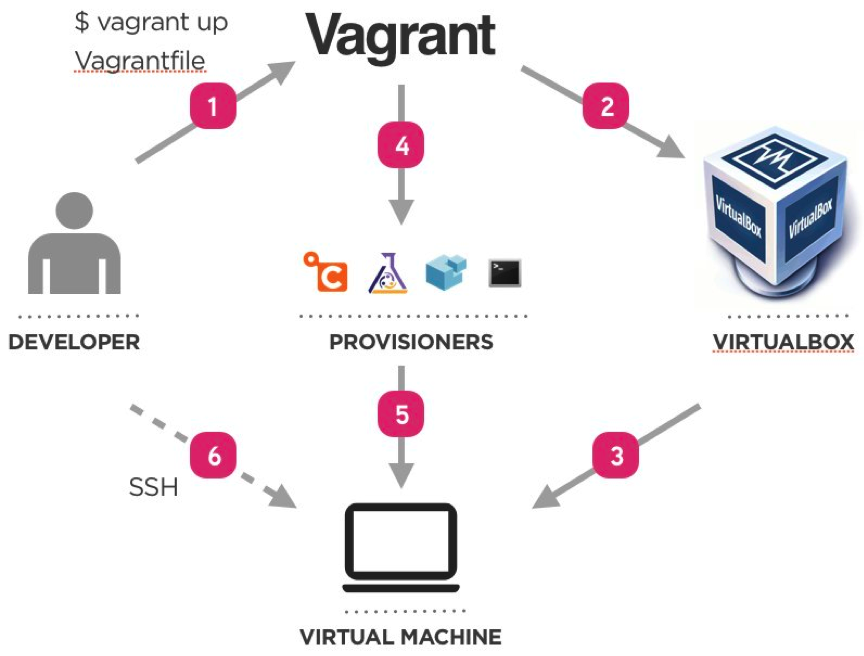

# Casos de la vida Real

*RRHH:* Hoy Empieza el nuevo desarrollador

*1era Tarea:*

* Levantar su entorno de desarrollo

--------------------------------------------------

# Tiempo de Tarea

## 1 dia o mas

--------------------------------------------------

# Cambios en la tecnologia:

* Salio la nueva version de Apache Solr.
* no usaremos Apache Solr usaremos Elastic Search

--------------------------------------------------

# Proyecto Papita con Huevo

## Inicio del Proyecto

* PHP 5.3
* Apache
* MySQL 5
* Apache Solr

--------------------------------------------------

# Proyecto Papita con Huevo

## 3 meses del proyecto

* PHP 5.5
* Nginx
* Apache Solr 4.8
* Redis
* MongoDB 3.0

--------------------------------------------------

# que Hacemos?

--------------------------------------------------

# Vagrant

--------------------------------------------------

# Que es?

* Herramienta Open Source
* Multiplataforma
* Permite Virtualizar ambientes
* Soporta Virtualbox VMWare

--------------------------------------------------

# Porque lo necesito.

* Probar server
* Ambientes de Desarrollo Repicables
* Optimizacion
* Tener las mismas dependencias que Produccion

--------------------------------------------------

# Instalacion

http://downloads.vagrantup.com/

Vagrant usa como dependencia un virtualizador de software (virtualbox)

https://www.virtualbox.org/

--------------------------------------------------

# Como Comienzo:

* Crear el VagrantFile (Describe los recursos, tipo de Maquina y Software que vamos a usar)

## Ejemplo

    !Bash

    mkdir test-vagrant
    cd test-vagrant
    vagrant init

--------------------------------------------------

# Box:

Es la imagen del sistema operativo que usaremos.

##  descargar de este enlace:

    !Bash

    http://www.vagrantbox.es/

## Ubuntu Box

    !Bash

    http://files.vagrantup.com/precise32.box

--------------------------------------------------

# Agregamos el Box:

    !Bash

    vagrant box add nombre_del_box http://url_del_box.box

## Vagrant box add:

    !Bash

    vagrant box add precise32 http://files.vagrantup.com/precise32.box

## Comprobemos:

    !Bash
    vagrant box list

--------------------------------------------------

# Usemos el Box:

## Vagrantfile:

    !Bash
    config.vm.box = "base"
    por
    config.vm.box = "precise32"

--------------------------------------------------

# Levantemos el Ambiente:

    !Bash

    vagrant up

    # ahora para instalar las dependencias es:

    vagrant ssh

--------------------------------------------------

# Ejemplo Instalar Git:

    !Bash

    vagrant ssh
    sudo apt-get update
    sudo apt-get install git

--------------------------------------------------

# Listo eso es Todo, Aplausos :P

--------------------------------------------------

# Preguntas:

* Esto me ayuda a tener entornos repicables?
* La instalacion pesa mucho, no lo puedo tener en un repo.
* para que hacer todo esto si puedo usar simplemente VirtualBox.
* Donde esta la Automatizacion? ...

--------------------------------------------------

# Exacto eso no es todo:

--------------------------------------------------

# Comandos de Vagrant:

    !Bash

    vagrant up
    vagrant init
    vagrant destroy
    vagrant halt
    vagrant provision
    vagrant ssh
    vagrant status

--------------------------------------------------

# Configuracion de Vagrant:

--------------------------------------------------

# Configuracion Network:

    !Puppet

    guest_config.vm.network :private_network, ip: "192.168.33.10"
    guest_config.vm.network "public_network"

--------------------------------------------------

# Enrutamiento de Puertos:

    !Puppet

    guest_config.vm.network :forwarded_port, guest: 80, host: 8888, auto_correct: true
    guest_config.vm.network :forwarded_port, guest: 3306, host: 8889, auto_correct: true
    guest_config.vm.network :forwarded_port, guest: 5432, host: 5433, auto_correct: true

--------------------------------------------------

# Configuracion de PC:

    !Puppet

    guest_config.vm.hostname = "guest"
    guest_config.vm.provider :virtualbox do |v|
      v.customize ["modifyvm", :id, "--natdnshostresolver1", "on"]
      v.customize ["modifyvm", :id, "--memory", "1024"]
    end

--------------------------------------------------

# Sincronizacion de Carpetas con NFS:

    !Puppet

    guest_config.vm.synced_folder "./", "/var/www", {:mount_options => ['dmode=777','fmode=777']}

--------------------------------------------------

# Exportar Box:

    !Puppet

    vagrant up
    (setup)
    vagrant halt
    vagrant package
    mv package.box ~/boxes/my_box.box

--------------------------------------------------

# Provision:

--------------------------------------------------

# Tipos de Provision:

* Shell
* Puppet
* Puppet Server
* Chef
* Chef Server
* Ansible
* Fabric

--------------------------------------------------

# Puppet:

    !Puppet

    guest_config.vm.provision :puppet do |puppet|
        puppet.manifests_path = "provision/puppet/manifests"
        puppet.manifest_file  = "init.pp"
        puppet.module_path = "provision/puppet/modules"
    end

--------------------------------------------------

# Flujo Vagrant:

--------------------------------------------------

# Demo:

--------------------------------------------------

# Vagrant Halt:

## Preguntas?

--------------------------------------------------

# Beneficios:

* Nos Ayuda a bajar la Barrera de entrada al Proyecto
